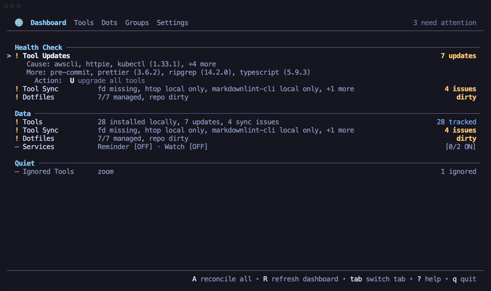

# Omni - Manage all your packages and dotfiles

<p align="center">
  
</p>

> ⚠️ Warning: Omni is early-stage software. Behavior can change. Use at your own risk.

## What It Does

Omni keeps your development tools and dotfiles in one portable JSON config. It tracks logical tools like `ripgrep`, `typescript`, or `black`, then installs them through the right local manager for each machine.

Main features:

- Portable providers for system, Node, and Python tools.
- Cross-machine host assignments and reusable groups.
- Dotfile sync/discovery backed by a git repo.
- CLI and TUI surfaces over the same app behavior.
- Privilege-aware package actions that avoid blocking TUI password prompts.
- Provider override repair and cleanup flows for machine-specific managers.
- Install, delete, upgrade, import, search, consolidate, and sync flows.

Supported managers include Homebrew, apt, apk, dnf, pacman, zypper, npm, pnpm, bun, uv, pip3, and pip.

## Prerequisites

- Installing with `go install` requires Go 1.26.2 or newer. Release archives and package-manager installs do not require Go.
- Tool management needs the package managers you enable to be installed on `PATH`. Omni detects supported system, Node, and Python managers and only uses the ecosystems you configure.
- Dotfile sync needs a configured dotfiles repo directory. Git is used for repo operations such as init, pull, push, auto-commit, and auto-push.
- Dotfile symlink sync uses GNU Stow (`stow`). Interactive flows from onboarding, settings, the Dots tab, or CLI prompts can offer to install Stow through the detected system package manager. Noninteractive CLI runs fail with install guidance instead of prompting.
- Package actions that require elevated privileges still need the host's normal sudo or admin authentication. Bulk TUI sync/upgrade skips privileged package actions; single Homebrew cask actions can open an embedded Admin Terminal prompt.

## Install

```sh
go install github.com/lkshrk/omni@latest
```

Releases also publish cross-platform archives, Linux package artifacts (`.deb`, `.rpm`, `.apk`, Arch Linux), and a Homebrew formula.

```sh
brew tap lkshrk/tap
brew install omni
```

## Usage

Run `omni` to start the TUI. On first launch, onboarding creates `~/.config/omni/settings.json`, lets you choose package ecosystems, creates this machine's host assignment, optionally imports installed tools, can enable dotfile sync, and lets you attach existing reusable groups. If a config already exists but this machine has no host entry yet, onboarding first offers to copy another host's reusable groups, host-local settings, provider overrides, and dotfile variants. After onboarding, Omni performs the first package scan; this can take a while on a fresh cache.

You can also create or edit `~/.config/omni/settings.json` directly. The current versioned schema lives at [spec/omni.settings.v1.schema.json](spec/omni.settings.v1.schema.json), with [spec/omni.settings.schema.json](spec/omni.settings.schema.json) kept as the latest-schema alias.

Omni's config model is intentionally small:

- `settings` choose ecosystem managers, provider tracking, and dotfile behavior.
- `tools` define logical tools and their default provider.
- `groups` contain single-owner tool and dotfile assignments.
- `hosts` assign groups to hostnames.
- Each host also gets a protected hostname group for machine-local tools.

```json
{
  "$schema": "https://raw.githubusercontent.com/lkshrk/omni/main/spec/omni.settings.v1.schema.json",
  "version": 1,
  "settings": {
    "ecosystems": {
      "node": { "manager": "bun" },
      "python": { "manager": "uv" }
    }
  },
  "tools": {
    "ripgrep": { "provider": "system" },
    "typescript": { "provider": "node" },
    "black": { "provider": "python" }
  },
  "hosts": {
    "workstation": ["dev"]
  },
  "groups": [
    {
      "name": "dev",
      "tools": ["ripgrep", "typescript", "black"],
      "dots": [
        { "name": "nvim", "path": "~/.config/nvim" }
      ]
    },
    { "name": "workstation", "special": "host" }
  ]
}
```

Base CLI workflow:

```sh
omni                                      # open the TUI
omni init                                 # run onboarding from the CLI
omni sync                                 # install/sync current host groups
omni sync --all                           # add discovered local tools and install missing tools
omni refresh                              # rescan installed/outdated tools and metadata
omni list                                 # show tool state
omni import                               # add installed tools to config
omni dots sync                            # sync dotfile links
```

Examples:

```sh
omni add fd --provider system             # add a logical tool
omni groups move-tool dev fd              # move a tool to a group
omni dots groups nvim --move dev          # move a dotfile entry to a group
omni dots sync --dry-run                  # preview dotfile links
omni settings set node.manager pnpm       # choose a host-local ecosystem manager
omni hosts copy laptop workstation        # seed a new host from an existing one
omni tools normalize --default-overrides --dry-run
                                          # preview cleanup of no-op provider overrides
```

### Dotfiles

Dotfiles are logical entries in groups, backed by Stow package directories in the configured repo. Each entry has one target path, such as `~/.config/nvim`, and one default package. If `package` is omitted, the package name defaults to the entry name.

#### Ignored Paths

Each dot entry can skip files inside its package with an `ignore` list. This is useful for local caches, generated files, logs, machine-local secrets, or anything that should not be copied into the repo or linked back into the target.

```json
{
  "name": "nvim",
  "path": "~/.config/nvim",
  "ignore": [
    "*.log",
    "cache/",
    "/local.lua",
    "!/cache/keep"
  ]
}
```

You can also manage these patterns from the CLI:

```sh
omni dots ignore nvim '*.log'
omni dots unignore nvim '*.log'
```

Patterns are evaluated in order, and later matches override earlier ones. Basename patterns such as `*.log` match files with that name anywhere in the entry. Patterns with `/` match paths relative to the entry root. A leading `/` anchors the pattern to the entry root, a trailing `/` matches a directory and its descendants, and `!` includes a path after an earlier ignore.

This syntax is gitignore-like, but it is not full Git `.gitignore` compatibility: nested ignore files, comments, escaping rules, and `**` wildmatch semantics are not supported. Host-specific variants use the same logical dot entry, so they inherit the same ignore rules.

#### Reminders

Omni can run a lightweight reminder check for dotfiles that need attention. The check is read-only: it does not sync, commit, push, or resolve conflicts. It reports dirty dotfiles repo state, entries that need sync, conflict resolution, untracked candidates, or missing repo sources.

```sh
omni dots reminder check
omni dots reminder run --notify
omni dots reminder install --interval 24h
omni dots reminder status
omni dots reminder uninstall
```

`install` creates a native user-level timer for the current platform: `launchd` on macOS or `systemd --user` on Linux. The installed timer runs `omni dots reminder run --notify` with the current `--config` and `--cache-dir` paths. Desktop notifications are best-effort; if notification delivery is unavailable, the reminder still writes normal command output to the service logs.

In the TUI, open Settings -> Dotfiles and toggle `Reminder Notifications` to install or remove the native reminder timer with notifications enabled. Use `Reminder Interval` to choose the timer interval before enabling it, or to update the installed timer.

#### Automatic Watch Sync

Omni can also watch configured dotfile source and target paths and run the normal dots sync flow after filesystem changes settle. The watcher uses OS filesystem events through `fsnotify`, not polling. It watches the dotfiles repo's `dotfiles/` subtree plus the active, non-ignored dot targets for this host, then debounces bursts before syncing.

```sh
omni dots watch run --debounce 5s
omni dots watch install --debounce 5s
omni dots watch status
omni dots watch uninstall
```

`run` keeps the watcher in the foreground for debugging. `install` creates a native user-level service: a `launchd` agent on macOS or a `systemd --user` service on Linux. The watcher repairs links, adopts eligible local-only files, and reports conflicts using the same app-level behavior as `omni dots sync`. It does not commit or push the dotfiles repo, even when dots auto-commit or auto-push settings are enabled; use `omni dots push` or normal git commands for that step.

In the TUI, open Settings -> Dotfiles and toggle `Watch Sync` to install or remove the native watcher service. Use `Watch Debounce` to choose how long Omni waits for file-change bursts to settle before syncing. Enabling watch sync requires GNU Stow, so the TUI prompts to install Stow first when needed.

#### Host-Specific Variants

Some dotfiles should exist on every host but differ per machine. For those, keep one logical dot entry and add host-specific package variants. Omni selects the active host's package by short hostname and falls back to the default package on hosts without an override.

```json
{
  "name": "nvim",
  "path": "~/.config/nvim",
  "package": "nvim",
  "hosts": {
    "workstation": { "package": "nvim@workstation" }
  }
}
```

The logical name stays `nvim` for groups, ignore rules, status, and TUI rows. Only the Stow package directory changes for the matching host.

CLI examples:

```sh
omni dots variant list nvim
omni dots variant add nvim --host workstation --sync
omni dots variant add gitconfig --sync
omni dots variant remove nvim --host workstation
```

When creating a variant, Omni uses an existing variant package from the repo when one is already present. Otherwise it seeds the new package from the current local target if it exists, falling back to the default repo package. Removing a variant switches the current host back to the default package and removes the unused variant package from the repo. In the TUI Dots tab, variant rows are marked with `◇`; press `v` on an eligible row, then `v` again to create or remove the current host's variant.

#### Backups

Before Omni mutates an existing local dotfile target, it creates a safety copy under `~/dotfiles.bkp`. The backup mirrors the target's home-relative path, so `~/.config/nvim/init.lua` becomes `~/dotfiles.bkp/.config/nvim/init.lua`. If that backup path already exists, Omni keeps the old copy and writes the next backup with a numeric suffix such as `.1`.

Backups are created for destructive local dotfile flows such as adopt/add, replacing a broken or conflicting target, resolving conflicts, deleting or disabling managed links, and unstowing. Dry-runs and no-op synced entries do not create backups. The backup covers local files, directories, and symlinks in your home directory; repo-side dotfile history is handled by the configured git repo and optional dots auto-commit/push settings.

For exact options, use:

```sh
omni --help
omni sync --help
omni dots --help
```

Global flags:

```sh
omni --config /path/to/settings.json        # override settings path
omni --cache-dir /tmp/omni-cache            # override tool cache path
omni -y | --yes                             # assume yes for prompts
```

Provider choices are stored as portable ecosystem providers such as `system`, `node`, and `python`. A concrete provider or manager is only stored through `install_with` when it is an intentional pin, for example `system` via `apt` on a host where the default would be `brew`. To clean older configs that explicitly pin the current default manager, preview first and then apply:

```sh
omni tools normalize --default-overrides --dry-run
omni tools normalize --default-overrides -y
```

Use the TUI for interactive tool management, host/group assignments, dotfile sync, settings, search, admin cask prompts, and the command palette.

## Development

```sh
make tui-live                             # run TUI with live/default config and cache
make tui-dev                              # run TUI with isolated dev config/cache
make cli-live ARGS='--help'               # run CLI with live/default config and cache
make cli-dev ARGS='tools normalize --default-overrides --dry-run'
                                          # run CLI with isolated dev config/cache
make build                                 # compile ./bin/omni
make test                                  # unit tests with race detector
make test-integration                      # Docker-isolated integration tests
make demo-gif                              # regenerate the README demo GIF
```

`make run` aliases `make tui-live`; `make cli` aliases `make cli-dev`. Dev targets default to `DEV_DIR=/private/tmp/omni-dev` and `DEV_HOST=devhost`.

The demo GIF target uses [VHS](https://github.com/charmbracelet/vhs) and records `demo/omni-demo.tape` against an isolated temp config, cache, home directory, fake package managers, and fake Stow binary.

CI runs vet, golangci-lint, unit tests, and Docker integration tests. Releases are CI-gated: if a successful CI commit has a `vX.Y.Z` tag, GoReleaser publishes the release artifacts and generates release notes from Conventional Commit subjects.

See [CONTRIBUTING.md](CONTRIBUTING.md) for contribution details.
